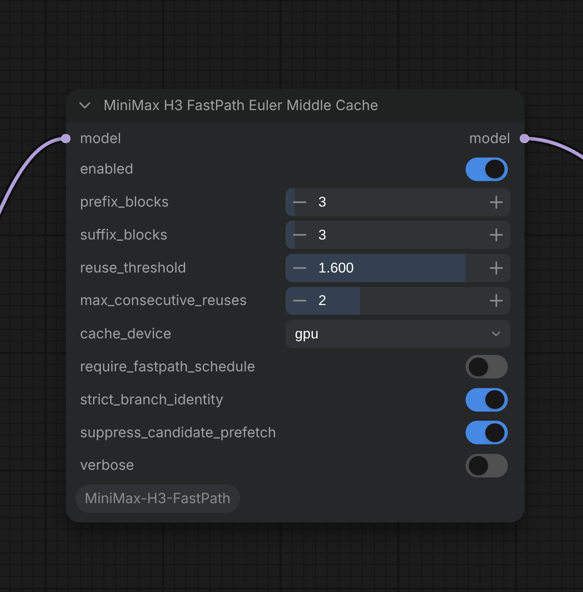

# ComfyUI-MiniMax-H3-FastPath

[](https://buymeacoffee.com/capitan01r)

Euler-only middle-block caching for native MiniMax H3 models in ComfyUI.

This custom node keeps the beginning and end of the MiniMax H3 transformer exact. Between them, it can reuse a previously measured middle-block residual when the current prefix features remain close enough to the cached call.

The cache is an approximation. Calls that do not pass its sampler, identity, topology, schedule, reuse-limit, and feature-change checks run the full transformer path.

<a href="images/node.png">
  
</a>

## Installation

```bash
cd ComfyUI/custom_nodes
git clone https://github.com/capitan01R/ComfyUI-MiniMax-H3-FastPath.git
```

Restart ComfyUI after installing or updating.

No extra Python packages are required beyond a working ComfyUI installation with native MiniMax H3 support.

## Included Node

| Node | Output | Purpose |
|---|---|---|
| **MiniMax H3 FastPath Euler Middle Cache** | `MODEL` | Runs an exact transformer prefix and suffix, with guarded residual reuse across a configurable middle block range. |

## Usage

Place **MiniMax H3 FastPath Euler Middle Cache** between the native MiniMax H3 diffusion model loader and a stock Euler sampler:

```text
Load Diffusion Model -> MiniMax H3 FastPath Euler Middle Cache -> Euler Sampler
```

Use your normal MiniMax H3 conditioning, latent, scheduler, guider, and VAE decode path.

For a standalone model or a model whose weights remain static during sampling, set `require_fastpath_schedule` to `false`. When it is `true`, approximation is allowed only when the model call contains the expected per-call FastPath LoRA-strength signature. If that signature is absent, the node safely runs the exact path.

The defaults are a practical starting point: `8` exact prefix blocks, `8` exact suffix blocks, a `0.12` reuse threshold, one consecutive reuse, and GPU cache storage.

## Controls

| Parameter | Default | Meaning |
|---|---:|---|
| `model` | — | Native MiniMax H3 diffusion model to clone and patch. |
| `enabled` | `true` | Enables the middle-block cache. When disabled, the cloned model is returned without the cache patch. |
| `prefix_blocks` | `8` | Number of exact transformer blocks executed before the cached middle range on every model call. |
| `suffix_blocks` | `8` | Number of exact transformer blocks executed after the cached middle range on every model call. |
| `reuse_threshold` | `0.12` | Maximum relative change in the sampled prefix feature for cached residual reuse. Lower values reject more candidates; higher values allow more approximation. |
| `max_consecutive_reuses` | `1` | Maximum accepted reuses before a full middle-block refresh is forced. A value of `1` alternates an accepted reuse with a full refresh while the signature remains stable. |
| `cache_device` | `gpu` | Stores the residual on GPU for speed or on CPU to reduce VRAM use. CPU reuse transfers the full residual back to the model device. |
| `require_fastpath_schedule` | `true` | Requires the matching per-call LoRA-strength signature before approximation is allowed. Set to `false` for standalone static-model use. |
| `strict_branch_identity` | `true` | Uses the exact path when ComfyUI does not provide enough information to separate conditioning branches safely. |
| `suppress_candidate_prefetch` | `true` | Prevents dynamic middle-block weight prefetch on likely reuse calls so skipped weights are not loaded unnecessarily. |
| `verbose` | `false` | Logs the sampler decision, cached range, and end-of-run cache statistics. |

## How It Works

On a full eligible call, the node:

1. Runs the configured prefix blocks exactly.
2. Samples a small probe from the prefix output and saves the middle-range input.
3. Runs every middle block exactly.
4. Stores the middle residual: `middle output - middle input`.
5. Runs the configured suffix blocks exactly.

On the next eligible call for the same branch and model-strength signature, the prefix still runs exactly. The node compares the new prefix probe with the saved probe. If the relative change is within `reuse_threshold`, it adds the cached residual to the current hidden state, skips the middle blocks, and continues through the exact suffix.

A full middle pass refreshes the residual when the feature gate rejects reuse, the consecutive-reuse limit is reached, the model-strength signature changes, or the cached tensor topology no longer matches. Topology checks include shape, dtype, device, token segmentation, time-embedding shape, and rotary-embedding shape.

Cache state is separated by conditioning-branch identity and cleared at the beginning and end of each sampling run. Cloned models receive independent runtime state.

## Behavior and Limits

- Residual reuse is enabled only for the stock Euler sampler. Other samplers use the full exact block path.
- Multi-GPU model calls use the full exact path.
- If strict branch identity is enabled and branch labels are unavailable, the full exact path is used.
- If cache allocation runs out of memory, caching is disabled for the rest of that sampling run and execution continues through the full block path.
- Existing per-block replacements are preserved on full middle-block calls. The node refuses installation when a whole block-loop replacement is already active.
- GPU cache storage is fastest. One residual uses approximately `sequence length × 5376 × bytes per element` for each active branch/call identity.
- Cached middle-block reuse is approximate. Disable the node when exact numerical equivalence is required.
